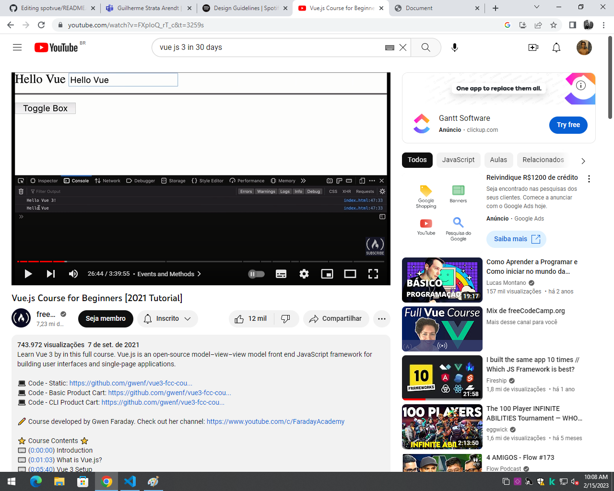

# spotvue

Esse projeto foi criado com o intuito de me aprofundar no framework vue criando um clone do spotify usando sua propria documentação como guia, planejo terminar o curso antes de começar a desenvolver o clone

<a href="https://developer.spotify.com/documentation/">Spotify Doc</a>

<a href="https://vuejs.org/guide/introduction.html">Vue Doc</a>

<a href="https://youtu.be/FXpIoQ_rT_c">Vue Course FreeCodeCamp</a>

<a href="https://open.spotify.com/?">Site Original</a>

